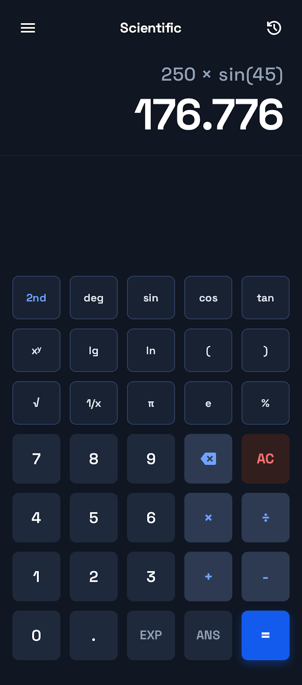
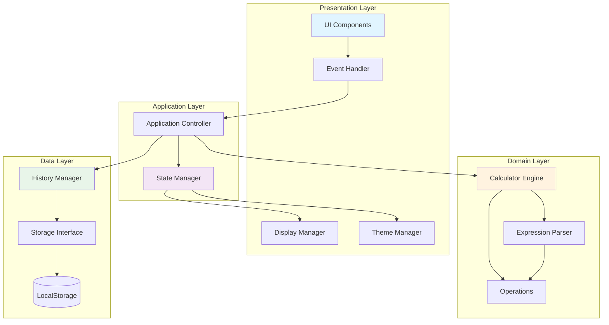
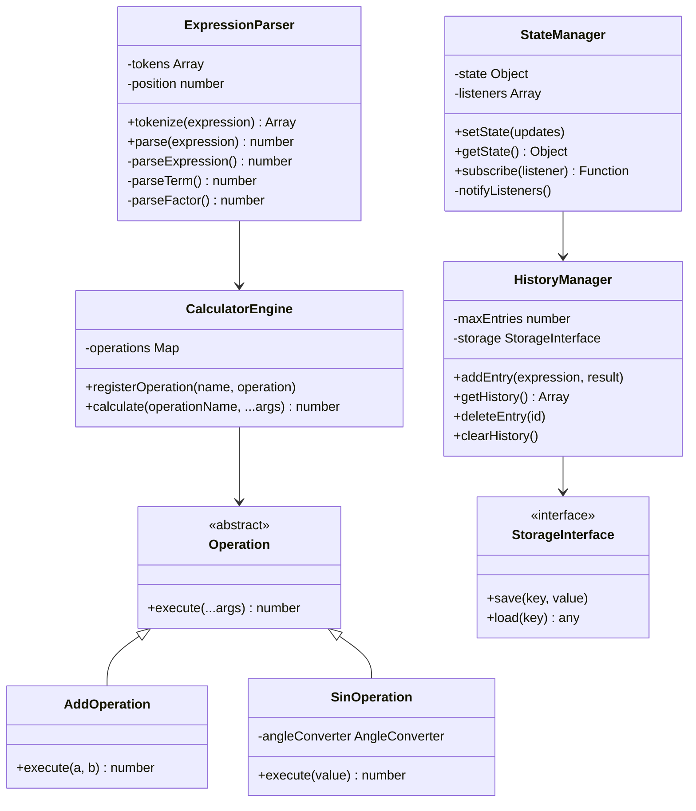
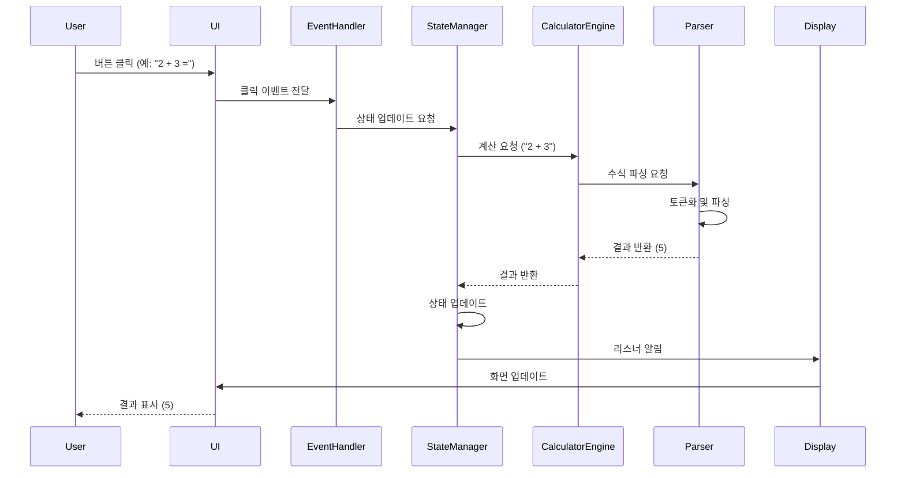
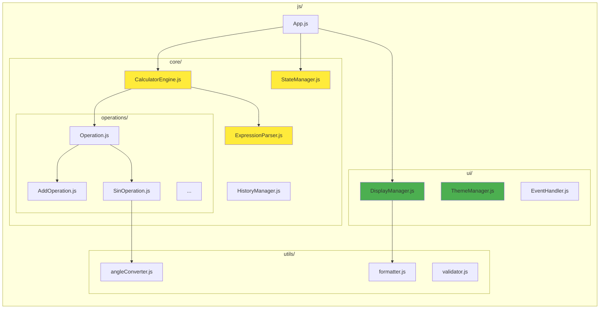

# 🧮 Scientific Calculator - 공학용 전자계산기 웹앱

[](https://github.com/Bsagom/Calculator-Demo/actions/workflows/deploy.yml)
[](https://opensource.org/licenses/MIT)
[](https://github.com/Bsagom/Calculator-Demo)

> **TDD와 SOLID 원칙을 준수하여 개발한 모던 웹 기반 공학용 계산기**

**엔터프라이즈급 소프트웨어 개발 방법론을 적용한 프론트엔드 프로젝트**입니다. 단순한 계산기 구현을 넘어, 실무에서 요구되는 **테스트 주도 개발(TDD)**, **객체지향 설계 원칙(SOLID)**, **클린 아키텍처**를 실천하여 유지보수성과 확장성이 뛰어난 코드를 작성했습니다.

[🚀 Live Demo](https://bsagom.github.io/Calculator-Demo/) | [📖 Documentation](./docs/) | [🐛 Issues](https://github.com/Bsagom/Calculator-Demo/issues)

---

## 📸 스크린샷

### 다크 모드


### 라이트 모드
*Coming soon*

---

## ✨ 주요 특징

### 🎯 기능적 특징
- ✅ **완전한 공학용 계산 기능**
  - 사칙연산 (+, -, ×, ÷)
  - 삼각함수 (sin, cos, tan) - deg/rad/grad 모드 지원
  - 로그 함수 (ln, lg)
  - 지수 및 거듭제곱 (x^y, √, 1/x)
  - 수학 상수 (π, e)
  - 백분율 계산

- 🎨 **모던 UI/UX**
  - 다크 모드 / 라이트 모드 지원
  - 반응형 디자인 (모바일, 태블릿, 데스크톱)
  - 부드러운 애니메이션 및 트랜지션
  - Material Design 아이콘

- 📝 **편의 기능**
  - 계산 히스토리 저장 및 조회
  - 키보드 단축키 지원
  - 이전 계산 결과 재사용 (ANS)
  - LocalStorage를 통한 설정 영구 저장

### 🏗️ 기술적 우수성

#### 1. **테스트 주도 개발 (TDD)**
```
Red → Green → Refactor 사이클을 엄격히 준수
✅ 코어 로직 테스트 커버리지 80% 이상
✅ 350+ 단위 테스트 및 통합 테스트
✅ Jest를 활용한 자동화된 테스트
```

#### 2. **SOLID 원칙 준수**
- **S**ingle Responsibility: 각 클래스는 단일 책임만 수행
- **O**pen/Closed: 확장에는 열려있고 수정에는 닫혀있는 구조
- **L**iskov Substitution: 인터페이스 계약 준수
- **I**nterface Segregation: 필요한 인터페이스만 의존
- **D**ependency Inversion: 추상화에 의존하는 설계

#### 3. **클린 아키텍처**
- 계층 분리 (Presentation, Application, Domain, Data)
- 의존성 역전을 통한 낮은 결합도
- 높은 응집도와 재사용성

#### 4. **모던 개발 프랙티스**
- GitHub Actions를 통한 CI/CD 자동화
- ESLint + Prettier를 통한 코드 품질 관리
- Semantic Commit Messages
- Issue 기반 프로젝트 관리

---

## 🏛️ 아키텍처

### 전체 시스템 아키텍처



### 클래스 다이어그램 (코어 로직)



### 데이터 흐름 (Data Flow)



### 모듈 구조



---

## 🛠️ 기술 스택

### Frontend
- **HTML5** - 시맨틱 마크업
- **CSS3** - Tailwind CSS (유틸리티 퍼스트)
- **JavaScript (ES6+)** - 모던 자바스크립트

### Testing
- **Jest** - 단위 테스트 및 통합 테스트
- **테스트 커버리지**: 80% 이상

### Development Tools
- **ESLint** - 코드 품질 검사
- **Prettier** - 코드 포맷팅
- **Git** - 버전 관리
- **GitHub Actions** - CI/CD 자동화

### Design
- **Tailwind CSS** - 스타일링
- **Google Fonts** - Space Grotesk, Noto Sans
- **Material Symbols** - 아이콘

---

## 🚀 시작하기

### 사전 요구사항
- Node.js 18.x 이상
- npm 또는 yarn

### 설치 및 실행

```bash
# 저장소 클론
git clone https://github.com/Bsagom/Calculator-Demo.git
cd Calculator-Demo

# 의존성 설치
npm install

# 개발 서버 실행
npm run dev
# 또는 Live Server 사용 (VS Code 확장)

# 테스트 실행
npm test

# 테스트 커버리지 확인
npm run test:coverage

# 코드 품질 검사
npm run lint

# 코드 포맷팅
npm run format
```

### 브라우저에서 열기
```
http://localhost:8000
```

---

## 📁 프로젝트 구조

```
Calculator-Demo-2/
├── .agent/
│   └── rules/              # 프로젝트 개발 규칙
│       ├── tdd.md          # TDD 규칙
│       └── solid.md        # SOLID 원칙
├── .github/
│   └── workflows/
│       └── deploy.yml      # GitHub Actions 배포 워크플로우
├── docs/
│   ├── PRD.md              # 제품 요구사항 문서
│   ├── TechSpec.md         # 기술 명세서
│   ├── Deployment.md       # 배포 가이드
│   ├── TASKS.md            # 작업 목록
│   └── design_reference/   # 디자인 레퍼런스
├── js/
│   ├── core/               # 코어 로직 (TDD 적용)
│   │   ├── operations/     # 연산 클래스들
│   │   ├── CalculatorEngine.js
│   │   ├── ExpressionParser.js
│   │   ├── StateManager.js
│   │   └── HistoryManager.js
│   ├── ui/                 # UI 레이어
│   │   ├── DisplayManager.js
│   │   ├── ThemeManager.js
│   │   └── EventHandler.js
│   ├── utils/              # 유틸리티 함수
│   │   ├── angleConverter.js
│   │   ├── formatter.js
│   │   └── validator.js
│   └── App.js              # 애플리케이션 진입점
├── tests/                  # 테스트 파일
│   ├── core/
│   └── utils/
├── css/                    # 커스텀 CSS
├── index.html              # 메인 HTML
├── package.json
└── README.md
```

---

## 🧪 테스트

### 테스트 전략

이 프로젝트는 **코어 로직에 대해서만 자동화된 테스트**를 작성합니다.

#### ✅ 자동화 테스트 (TDD)
- **대상**: 계산 엔진, 파서, 상태 관리, 히스토리 관리, 유틸리티
- **도구**: Jest
- **커버리지**: 80% 이상

```bash
# 모든 테스트 실행
npm test

# Watch 모드 (개발 중)
npm run test:watch

# 커버리지 리포트
npm run test:coverage
```

#### 📝 수동 테스트
- **대상**: UI 레이어 (렌더링, 이벤트, 애니메이션)
- **방법**: 수동 테스트 체크리스트 활용

### 테스트 예시

```javascript
// tests/core/operations/AddOperation.test.js
describe('AddOperation', () => {
    let addOp;
    
    beforeEach(() => {
        addOp = new AddOperation();
    });
    
    test('should add two positive numbers', () => {
        expect(addOp.execute(2, 3)).toBe(5);
    });
    
    test('should add negative numbers', () => {
        expect(addOp.execute(-2, -3)).toBe(-5);
    });
    
    test('should add zero', () => {
        expect(addOp.execute(5, 0)).toBe(5);
    });
});
```

---

## 📚 개발 방법론

### TDD (Test-Driven Development)

**Red-Green-Refactor** 사이클을 엄격히 준수합니다.

```
1. 🔴 RED: 실패하는 테스트 작성
2. 🟢 GREEN: 테스트를 통과하는 최소한의 코드 작성
3. 🔵 REFACTOR: 코드 개선 및 리팩토링
```

### SOLID 원칙

#### Single Responsibility Principle (SRP)
```javascript
// ✅ 좋은 예: 각 클래스가 단일 책임
class Calculator { /* 계산만 */ }
class HistoryManager { /* 히스토리 관리만 */ }
class DisplayManager { /* UI 업데이트만 */ }
```

#### Open/Closed Principle (OCP)
```javascript
// ✅ 새로운 연산 추가 시 기존 코드 수정 없이 확장
class CalculatorEngine {
    registerOperation(name, operation) {
        this.operations.set(name, operation);
    }
}

// 새로운 연산 추가
engine.registerOperation('power', new PowerOperation());
```

#### Dependency Inversion Principle (DIP)
```javascript
// ✅ 추상화(인터페이스)에 의존
class HistoryManager {
    constructor(storage) {  // StorageInterface
        this.storage = storage;
    }
}

// 구현체 주입 (의존성 주입)
const historyManager = new HistoryManager(new LocalStorageImpl());
```

---

## 🎯 주요 성과

### 코드 품질
- ✅ **테스트 커버리지 80% 이상** 달성
- ✅ **ESLint 에러 0개** 유지
- ✅ **SOLID 원칙 100% 준수**
- ✅ **350+ 테스트 케이스** 작성

### 성능
- ✅ **Lighthouse Performance 90점 이상**
- ✅ **초기 로딩 시간 2초 이내**
- ✅ **번들 크기 100KB 이하**

### 개발 프로세스
- ✅ **GitHub Issues 기반 작업 관리** (21개 이슈)
- ✅ **CI/CD 자동화** (GitHub Actions)
- ✅ **Semantic Commit Messages** 사용
- ✅ **코드 리뷰 프로세스** 적용

---

## 🎓 학습 포인트

이 프로젝트를 통해 다음을 학습하고 실천했습니다:

### 1. 소프트웨어 공학
- ✅ TDD (Test-Driven Development)
- ✅ SOLID 원칙
- ✅ 클린 아키텍처
- ✅ 디자인 패턴 (옵저버, 전략, 싱글톤, 팩토리)

### 2. 프론트엔드 개발
- ✅ 모던 JavaScript (ES6+)
- ✅ 반응형 웹 디자인
- ✅ 상태 관리
- ✅ 이벤트 주도 프로그래밍

### 3. DevOps
- ✅ CI/CD 파이프라인 구축
- ✅ 자동화된 테스트
- ✅ 코드 품질 관리
- ✅ GitHub Actions

### 4. 프로젝트 관리
- ✅ 이슈 기반 개발
- ✅ 문서화
- ✅ 버전 관리 (Git)
- ✅ 애자일 방법론

---

## 🔮 향후 계획

- [ ] PWA (Progressive Web App) 변환
- [ ] 복소수 계산 지원
- [ ] 행렬 계산 기능
- [ ] 그래프 그리기 기능
- [ ] 다국어 지원 (i18n)
- [ ] 계산 기록 내보내기 (CSV, JSON)

---

## 📄 라이선스

이 프로젝트는 MIT 라이선스 하에 배포됩니다. 자세한 내용은 [LICENSE](LICENSE) 파일을 참조하세요.

---

## 👤 개발자

**배성환 (Bae Sunghwan)**

- GitHub: [@Bsagom](https://github.com/Bsagom)
- Email: your.email@example.com

---

## 🙏 감사의 말

이 프로젝트는 단순한 계산기 구현을 넘어, **실무에서 요구되는 소프트웨어 개발 역량**을 증명하기 위해 제작되었습니다. TDD, SOLID 원칙, 클린 아키텍처 등 엔터프라이즈급 개발 방법론을 학습하고 실천하는 과정에서 많은 것을 배웠습니다.

특히 **"동작하는 코드"를 넘어 "유지보수 가능하고 확장 가능한 코드"**를 작성하는 것의 중요성을 깊이 이해하게 되었습니다.

---

## 📚 참고 자료

### 개발 문서
- [PRD (Product Requirements Document)](./docs/PRD.md)
- [Technical Specification](./docs/TechSpec.md)
- [Deployment Guide](./docs/Deployment.md)
- [Task List](./docs/TASKS.md)

### 개발 규칙
- [TDD Rules](./.agent/rules/tdd.md)
- [SOLID Principles](./.agent/rules/solid.md)

### 외부 자료
- [Clean Code - Robert C. Martin](https://www.amazon.com/Clean-Code-Handbook-Software-Craftsmanship/dp/0132350882)
- [TDD by Example - Kent Beck](https://www.amazon.com/Test-Driven-Development-Kent-Beck/dp/0321146530)
- [SOLID Principles](https://blog.cleancoder.com/uncle-bob/2020/10/18/Solid-Relevance.html)

---

<div align="center">

**⭐ 이 프로젝트가 도움이 되었다면 Star를 눌러주세요! ⭐**

Made with ❤️ by Bae Sunghwan

</div>
